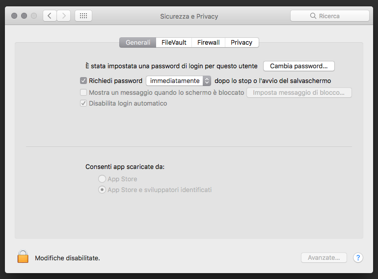

# Installazione

Nel workshop costruirai un blog, e ci sono alcuni task dedicati all'installazione che sarebbe bello completare in anticipo, in modo che tu sia pronta a scrivere codice in giornata.

Assicurati di avere il tuo coach a disposizione in caso di dubbi o problemi.

I programmi che andremo a installare sono:

* [Homebrew](#installare-homebrew), solo per macOS
* [Python](#installare-python)
* [Django](#installare-django)
* [Git](#installare-git)
* [un editor di codice](#installare-un-editor-di-codice)
* [Heroku](#heroku-toolbelt)

Ricordati anche di creare un account su [Heroku](#heroku).

Buona fortuna!

# Installare Homebrew

<!--sec data-title="macOS" data-id="homebrew_OSX" data-collapse=true ces-->
Attenta: questa sezione descrive un metodo alternativo per installare applicazioni e utility sul tuo sistema macos. Non ci sono controindicazioni, anzi, scoprirai che è un modo semplice e rapido! Se scegli questa strada devi solo ricordarti, da questo momento, di far riferimento alle sezioni di installazione che riguardano l'uso di Homebrew (brew) e saltare le procedure di installazione normali che rimandano al sito di ogni specifica applicazione.

[Homebrew](https://brew.sh) è un packet manager per macOS ovvero un'utility che permette di semplificare le operazioni di installazione, aggiornamento e disinstallazione di applicazioni attraverso semplici comandi impartiti dalla **linea di comando**. Questo passaggio ti faciliterà le successive installazioni richieste e potrà tornarti molto utile anche in futuro.

Nei prossimi passaggi dovrai usare la **linea di comando** (ne parleremo più avanti nel tutorial). Per adesso, se hai bisogno di aprirla, vai nel `Launchpad` e apri l'app `Terminale`. Puoi anche tenere premere contemporanemente il tasto `mela + spazio` e comparirà la barra di ricerca. Per aprire la linea di comando ti basterà scrivere `Terminale` e premere `enter`.

Adesso che il terminale è aperto digita il seguente comando:

command-line

/usr/bin/ruby -e "$(curl -fsSL https://raw.githubusercontent.com/Homebrew/install/master/install)"
==> This script will install:
/usr/local/bin/brew
/usr/local/share/doc/homebrew
/usr/local/share/man/man1/brew.1
/usr/local/share/zsh/site-functions/_brew
/usr/local/etc/bash_completion.d/brew
/usr/local/Homebrew

Press RETURN to continue or any other key to abort


Questo scaricherò uno speciale script da internet, indicherà le azioni che andrà a svolgere e rimarrà in attesa della pressione del tasto invio per confermare l'installazione (o un qualsiasi altro per annullare l'operazione).

> Durante questa fase dell'installazione verrà richiesta la password per svolgere alcune operazioni che richiedono privilegi di sistema. La password dovrà essere digitata alla cieca, infatti non sarenno scritti né i caratteri digitati, né
degli asterischi `*` per motivi di sicurezza. Digitata la password si dovrà premere il tasto `enter`.

Se tutto si concluderà correttamente avrai il comando `brew` disponibile sul tuo sistema, provalo:

command-line

brew info
HOMEBREW_VERSION: 2.0.4-6-gae0332a
ORIGIN: https://github.com/Homebrew/brew.git
HEAD: ae0332a0f6fcf4846ef032ba217fb00ef66ccc48
Last commit: 67 minutes ago
Core tap ORIGIN: https://github.com/Homebrew/homebrew-core
Core tap HEAD: a6fc7849abf7d93ec823c55ba37052c0ba22e799
Core tap last commit: 38 minutes ago
HOMEBREW_PREFIX: /usr/local
HOMEBREW_DEV_CMD_RUN: 1
HOMEBREW_DISPLAY: /private/tmp/com.apple.launchd.NwNSvEwpgI/org.macosforge.xquartz:0
HOMEBREW_LOGS: /Users/tuonome/Library/Logs/Homebrew
HOMEBREW_VISUAL: vim
CPU: octa-core 64-bit haswell
Homebrew Ruby: 2.3.7 => /System/Library/Frameworks/Ruby.framework/Versions/2.3/usr/bin/ruby
Clang: 10.0 build 1000
Git: 2.20.1 => /usr/local/bin/git
Curl: 7.54.0 => /usr/bin/curl
Java: 11.0.2, 1.8.0_202
macOS: 10.14.3-x86_64
CLT: 10.1.0.0.1.1539992718
Xcode: 10.1
CLT headers: 10.1.0.0.1.1539992718
XQuartz: 2.7.11 => /opt/X11


Da adesso puoi usare `brew` per installare il software proposto e tanto altro!

<!--endsec-->

# Installare Python

> Questa sezione si basa su un tutorial fatto da Geek Girls Carrots (https://github.com/ggcarrots/django-carrots)

Django è scritto in Python. Abbiamo bisogno di Python per fare qualsiasi cosa in Django. Iniziamo con l'installazione! Vogliamo che sul tuo pc sia installato Python 3.7.5, quindi se hai una versione precedente, dovrai aggiornarlo.

<!--sec data-title="Windows" data-id="python_windows" data-collapse=true ces-->

Per prima cosa bisogna controllare se la tua versione di Windows è a 32-bit o 64-bit, per farlo premi il tasto `Windows + Pausa/Break`, che apriranno le informazioni di sistema e cerca "Tipo sistema".

Puoi scaricare Python per Windows dal sito web ufficiale.

Devi andare sul sito https://www.python.org/downloads/windows/. Fai click sul link "Latest Python 3 Release - Python x.x.x" e scarica il programma d'installazione di Python, se la tua versione di Windows è **64-bit**, scarica **Windows x86-64 executable installer**. Altrimenti, scarica **Windows x86 executable installer**.

Dopo aver scaricato l'installer, lo dovresti eseguire (cliccaci sopra due volte) e segui le istruzioni. È importante ricordare il percorso (la directory) dove ha installato Python. Più tardi sarà necessario!

Una cosa a cui fare **attenzione**: in una schermata dell'installazione guidata, contrassegnata con "Setup", assicurati di scegliere l'opzione "Add Python 3.7 to PATH", come illustrato qui:

Nei prossimi passaggi dovrai usare la **linea di comando** (ne parleremo più avanti nel tutorial). Per adesso, se hai bisogno di aprirla, vai nel menù Start → Accessori → Prompt dei comandi . Puoi anche tenere premuto il tasto `Windows` e premere il pulsante `R` finché la finestra `Run` non compare. Per aprire la linea di comando ti basterà scrivere `cmd` e premere `enter` nella finestra `Run`.
(Nelle nuove versioni di Windows potrebbe essere necessario cercare `Prompt dei comandi` perché a volte è nascosta.)

>Nota: se stai usando una vecchia versione di Windows (7, Vista, o qualsiasi versione più vecchia) e l'installer di python 3.7.x ti dà un errore puoi provare queste cose:

>1. installa tutti gli update di Windows Updates e riprova; o
2. installa una [vecchia versione Python](https://www.python.org/downloads/windows/), es., [3.4.6](https://www.python.org/downloads/release/python-346/).

>Se installi una vecchia versione di Python, la schermata di installazione potrebbe essere un pochino diversa. **Assicurati** di scrollare per vedere "Add python.exe to Path", quindi fai click sul bottone a sinistra e seleziona "Will be installed on local hard drive":

<!--endsec-->

<!--sec data-title="macOS" data-id="python_OSX"
data-collapse=true ces-->

> **Note** Prima di installare Python su macOS, devi assicurarti che nelle impostazioni del tuo Mac permettano l'installazione di applicazioni che non provengono dell'App Store. Vai nelle `Preferenze di Sistema` cliccando sulla mela in alto a sinistra, fai click su `Sicurezza & Privacy`, quindi sul tab `Generali`. Se `Consenti app scaricate da:` è impostato su `App Store` cambialo in `App Store e sviluppatori identificati`.

Devi andare sul sito https://www.python.org/downloads/mac-osx/. Fai click sul link "Latest Python 3 Release - Python x.x.x" e scarica il programma d'installazione di Python:

- Scarica *Mac OS X 64-bit/32-bit installer*,
- Fai doppio click sul file appena scaricato per iniziare l'installazione.

Nei prossimi passaggi dovrai usare la **linea di comando** (ne parleremo più avanti nel tutorial). Per adesso, se hai bisogno di aprirla, vai nel `Launchpad` e apri l'app `Terminale`. Puoi anche tenere premere contemporanemente il tasto `mela + spazio` e comparirà la barra di ricerca. Per aprire la linea di comando ti basterà scrivere `Terminale` e premere `enter`.

- Una volta aperto il terminale, dovrai digitare il seguente comando (il percorso potrebbe essere **/Applications/Python\ 3.7/Install\ Certificates.command** a seconda della versione di python installata. Questo serve ad aggiornare dei componenti del tuo computer per far funzionare correttamente Python.

command-line

/Applications/Python\ 3.7/Install\ Certificates.command


Non aver paura: in caso di dubbi o problemi, chiedi al tuo coach!

<!--endsec-->

<!--sec data-title="macOS_homebrew" data-id="python_macOS_homebrew"
data-collapse=true ces-->

Una volta aperto il terminale, dovrai digitare il seguente comando:

command-line

brew install python3


<!--endsec-->

<!--sec data-title="Linux" data-id="python_linux"
data-collapse=true ces-->

### Linux

Nei prossimi passaggi dovrai usare la **linea di comando** (ne parleremo più avanti nel tutorial). Per adesso, se hai bisogno di aprirla, vai nelle `Applicazioni` e apri l'app `Terminale`.

È molto probabile che tu abbia Python già installato di default. Per controllare se ce l'hai già installato (e quale versione è), apri linea di comando e digita il seguente comando:

command-line

python3 --version
Python 3.7.5


Se non hai Python installato o se vuoi una versione diversa, puoi installarla come segue:

#### Debian o Ubuntu

Digita questo comando nella tua console:

command-line

sudo apt-get install python3.7


#### Fedora

Usa questo comando nella tua console:

command-line

sudo dnf install python3


#### openSUSE

Usa questo comando nella tua console:

command-line

sudo zypper install python3


<!--endsec-->

Verifica che l'installazione sia andata a buon fine aprendo la command line e scrivi il comando `python3`:

command-line

python3 --version
Python 3.7.5


**Note** Se usi Windows e ottieni un messaggio di errore tipo `python3` non è stato trovato, prova ad usare solo `python` (senza il `3`) e controlla che sia una versione di Python 3.7 come mostrato sopra.

----

Se hai dubbi o se qualcosa è andato storto e non hai idea di cosa fare dopo, chiedi al tuo coach! A volte le cose non vanno come dovrebbero ed è meglio chiedere aiuto a qualcuno con più esperienza.

# Installare Django

> Una parte di questo capitolo si basa sui tutorial delle Geek Girls Carrots (https://github.com/ggcarrots/django-carrots).
>
> Una parte di questo capitolo di basa sul [django-marcador tutorial](http://django-marcador.keimlink.de/) sotto licenza Creative Commons Attribution-ShareAlike 4.0 International License. Il tutorial di django-marcador è protetto da copyright di Markus Zapke-Gründemann et al.

Ritroverai questo passaggio anche più avanti nel tutorial: puoi ignorarlo quando lo incontrerai di nuovo, se userai la stessa cartella durante la giornata del workshop.

In questa fase ci serve per essere sicuri che sia tutto installato correttamente.

## Installare Django

Per questo tutorial useremo una nuova directory `djangogirls` dalla tua home directory, ovvero la cartella principale del tuo utente, quindi apri una nuova linea di comando e digita:

command-line

mkdir djangogirls
cd djangogirls


Non ti preoccupare se non sai cosa vogliano dire questi comandi, più avanti nel tutorial li guarderemo tutti.

Ora che siamo nella cartella giusta, puoi installare Django usando `pip`. Nella console, esegui `pip3 install --user django~=2.1.0` (nota che usiamo una tilde seguita da un simbolo di uguale: `~=`).

command-line

pip3 install --user django~=2.1 whitenoise~=4.1.0
Collecting django~=2.1
Downloading Django-2.1.7-py2.py3-none-any.whl (6.8MB)
Installing collected packages: django
Successfully installed django-2.1.7


**Note** Assicurati di usare `pip3` invece di `pip` se durante l'installazione di Django ottieni l'errore `Could not find a version that satisfies the requirement django~=2.1`.

<!--sec data-title="Windows" data-id="django_err_windows"
data-collapse=true ces-->

> Se ottieni un errore quando chiami `pip` sulla piattaforma Windows controlla se il pathname del tuo progetto contiene spazi, accenti o caratteri speciali (i.e. `C:\Users\User Name\djangogirls`). Se è così ti conviene spostarlo in un altro path senza spazi, accenti o caratteri speciali (il suggerimento è: `C:\djangogirls`). Dopo averlo spostato, prova ad eseguire di nuovo il comando di cui sopra.

<!--endsec-->

<!--sec data-title="Windows 8 e Windows 10" data-id="django_err_windows8and10"
data-collapse=true ces-->

> La tua linea di comando potrebbe andare in freeze quando provi ad installare Django, se così fosse prova questo comando invece di quello sopra
>
>command-line
>
python -m pip install django~=2.1 whitenoise~=4.1.0


<!--endsec-->

<!--sec data-title="Linux" data-id="django_err_linux"
data-collapse=true ces-->

> Se ottieni un errore quando esegui il comando `pip` su Ubuntu 12.04, prova ad eseguire `python -m pip install -U --force-reinstall pip` per risolvere il problema.

<!--endsec-->

Questo è tutto! Sei (finalmente) pronta a creare un'applicazione Django!

# Installare un editor di codice

Sono disponibili diversi editor e la scelta di uno piuttosto che un altro dipende principalmente dal gusto personale. La maggior parte dei programmatori Python usa complessi ma estremamente potenti IDE (ambienti di sviluppo integrati), come PyCharm. Tuttavia, dal momento che sei ancora agli inizi non è l'editor più appropriato; quelli che ti suggeriremo noi sono ugualmente potenti ma molto più semplici da utilizzare.

I nostri suggerimenti sono riportati qui di seguito, ma sentiti libero/a di chiedere al tuo coach quali sono le sue preferenze in materia di editor, in questo modo sarà più semplice per il tuo coach aiutarti.

## Atom

Atom è un editor di codice creato da [GitHub](https://github.com/). È gratuito, open-source, facile da installare e da usare. È disponibile per Windows, macOS e Linux.

[Scaricalo qui](https://atom.io/)

<!--sec data-title="macOS_homebrew" data-id="atom_install_macOS_homebrew"
data-collapse=true ces-->

command-line

brew cask install atom


<!--endsec-->

## PyCharm Community Edition

PyCharm è uno tra gli editor più utilizzati per Python, prodotto da [JetBrains](https://www.jetbrains.com/). È molto facile da installare e da utilizzare ed è disponibile per tutti i sistemi operativi.

[Scaricalo qui](https://www.jetbrains.com/pycharm/download/)

<!--sec data-title="macOS_homebrew" data-id="pycharm_ce_install_macOS_homebrew"
data-collapse=true ces-->

command-line

brew cask install pycharm-ce


<!--endsec-->

## Visual Studio Code

Editor di codice creato in casa [Microsoft](https://microsoft.com). È gratuito e open-source, con le batterie incluse. Disponibile per tutti i sistemi operativi.

[Scaricalo qui](https://code.visualstudio.com/)

## Perché installiamo un editor di codice?

Forse ti stai chiedendo per quale motivo installiamo questo editor di codice invece di usare un applicazione come Word or Blocco Note.

Il primo motivo è che il codice deve essere **testo semplice**, e il problema con programmi come Word e Textedit è che in realtà non producono testo semplice. Producono testo RTF (con caratteri e formattazione), utilizzando formati personalizzati come [RTF (Rich Text Format)](https://en.wikipedia.org/wiki/Rich_Text_Format).

La seconda ragione è che i code editor sono specializzati per programmare, perciò hanno molte funzionalità utili, ad esempio diversi colori per evidenziare frammenti di codice con diversi significati, o l'inserimento automatico del secondo paio di virgolette.

Vedremo tutto ciò più tardi. Il tuo fidato code editor sarà presto uno dei tuoi strumenti preferiti. :)

# Installare Git

Git è un "sistema di controllo versione" usato da un sacco di programmatori. Questo software ci permette di tracciare le modifiche ai file nel tempo, in modo che tu possa riprendere una versione specifica più tardi. Come le "Versioni" in Microsoft Word, ma molto più potente.

## Installare Git

<!--sec data-title="Windows" data-id="git_install_windows"
data-collapse=true ces-->

È possibile scaricare Git da [git-scm.com](https://git-scm.com/). Puoi saltare tutti i passaggi tranne uno. Nel quinto passaggio, dal titolo "Regolazione della variabile PATH di sistema", scegli "Esegui Git e gli strumenti Unix associati dalla riga di comando di Windows" (l'opzione in basso). A parte questo, i valori predefiniti vanno bene. 'Checkout Windows-style' e 'commit Unix-style line endings' vanno bene.

Non dimenticare di chiudere e riaprire la linea di comando dopo che l'installazione è finita.
<!--endsec-->

<!--sec data-title="macOS" data-id="git_install_OSX"
data-collapse=true ces-->

Scarica Git da [git-scm.com](https://git-scm.com/) e segui le istruzioni.

> **Note** Se usi OS X 10.6, 10.7, or 10.8, dovrai installare git partendo da qui: [Git installer for OS X Snow Leopard](https://sourceforge.net/projects/git-osx-installer/files/git-2.3.5-intel-universal-snow-leopard.dmg/download)

<!--endsec-->

<!--sec data-title="macOS_homebrew" data-id="git_install_macOS_homebrew"
data-collapse=true ces-->

command-line

brew install git


<!--endsec-->

<!--sec data-title="Debian o Ubuntu" data-id="git_install_debian_ubuntu"
data-collapse=true ces-->

command-line

sudo apt-get install git


<!--endsec-->

<!--sec data-title="Fedora" data-id="git_install_fedora"
data-collapse=true ces-->

command-line

sudo dnf install git


<!--endsec-->

<!--sec data-title="openSUSE" data-id="git_install_openSUSE"
data-collapse=true ces-->

command-line

sudo zypper install git


<!--endsec-->

# Heroku

Vai su [Heroku](https://heroku.com/) e iscriviti facendo attenzione a selezionare Python nel menù `Primary Development Language`.

## Heroku Toolbelt

Avrai bisogno di installare la [**Toolbelt**](https://toolbelt.heroku.com/) è come una cintura dei supereroi: contiene tutti gli strumenti per gestire il *tuo* server.

<!--sec data-title="Windows" data-id="heroku_install_windows"
data-collapse=true ces-->

Assicurati che tutte le opzioni siano selezionate quando ti verrà richiesto quale componenti installare. Al termine dell'installazione chiudi e riapri la linea di comando.

Dopo aver riaperto la linea di comando ricordati di tornare alla cartella `djangogirls`.

<!--endsec-->

<!--sec data-title="macOS_homebrew" data-id="heroku_install_macOS_homebrew"
data-collapse=true ces-->

command-line

brew tap heroku/brew && brew install heroku


<!--endsec-->

Per controllare che tutto sia andato a buon fine e per finire la configurazione dobbiamo effettuare il login con heroku.

Apri la linea di comando e digita:

command-line

heroku login
Enter your Heroku credentials.
Email: adam@example.com
Password (typing will be hidden):
Authentication successful.


# Inizia la lettura

Complimenti, ora sei pronta! Se hai un po' di tempo prima del workshop, potrebbe essere utile cominciare a leggere i capitoli iniziali:

- [Come funziona Internet](../how_the_internet_works/README.md)

- [Introduzione alla command line](../intro_to_command_line/README.md)

- [Introduzione a Python](../python_introduction/README.md)

- [Che cos'è Django?](../django/README.md)

# Enjoy the workshop!

Quando inizierai il workshop potrai partire direttamente da [Il tuo primo progetto in Django!](../django_start_project/README.md)
